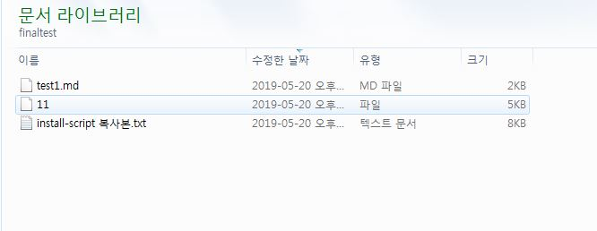

# repository
sudo wget https://archive.cloudera.com/cm5/redhat/7/x86_64/cm/cloudera-manager.repo -P /etc/yum.repos.d/
vi /etc/yum.repos.d/cloudera-manager.repo
cat /etc/yum.repos.d/cloudera-manager.repo

java -version

# key gen
ssh-keygen
ls ~/.ssh/
ssh-copy-id -i ~/.ssh/id_rsa.pub t4h2
ssh-copy-id -i ~/.ssh/id_rsa.pub t4h1
ssh-copy-id -i ~/.ssh/id_rsa.pub t4h3
ssh-copy-id -i ~/.ssh/id_rsa.pub t4h4
ssh-copy-id -i ~/.ssh/id_rsa.pub t4h5
ssh t4h1
ssh t4h3
ssh t4h2

# jdk 설치 
yum list java*jdk-devel
yum install -y java-1.8.0-openjdk-devel.x86_64

# mysql-JDBC Connector 설치 

**configure repository 
sudo yum install -y wget
sudo wget https://dev.mysql.com/get/Downloads/Connector-J/mysql-connector-java-5.1.47.tar.gz

$ tar  mysql-connector-java-5.1.47.tar.gz
mkdir -p /usr/share/java/
cd mysql-connector-java-5.1.47
cp mysql-connector-java-5.1.47-bin.jar /usr/share/java/mysql-connector-java.jar
cd  /usr/share/java
yum install mysql-connector-java

# 방화벽해제

vi /etc/sysconfig/selinux
SELINUX=enforcing => disabled
init 6

iptables -L
sestatus

#클라우데라서버설치
yum install cloudera-manager-daemons cloudera-manager-server
yum install cloudera-manager-daemons cloudera-manager-agent
cd /etc/cloudera-scm-agent/
ls
vi config.ini  --수정없음.
service cloudera-scm-agent start

#마리아db설치
yum install mariadb-server
systemctl stop mariadb
cd /etc
ls
vi my.conf
systemctl enable mariadb
systemctl start mariadb
/usr/bin/mysql_secure_installation
#마리아 db DB,USER 생성
mysql -u root -p
CREATE DATABASE scm DEFAULT CHARACTER SET utf8 DEFAULT COLLATE utf8_general_ci;
cd /usr/share/cmf/schema
ls
cat scm_prepare_database.sh
./scm_prepare_database.sh mysql scm scm toor

# scm server start
systemctl start cloudera-scm-server
tail -f /var/log/cloudera-scm-server/cloudera-scm-server.log
 